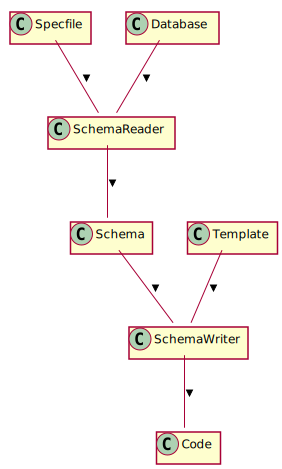
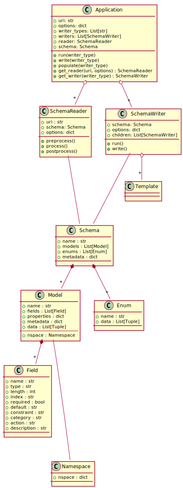

Development Guide
=================

This guide contains notes for use of the API and also extension of ``xlschema`` via plugins or writer classes and templates.

You can get the code from::

  $ git clone https://github.com/rezayat/xlschema.git

Architecture
------------

This section containts diagrams in UML [#f1]_ to describe class relationships and dataflows.

Design (To-Be)
^^^^^^^^^^^^^^

Data Flow
"""""""""

Class Structure
"""""""""""""""

.. [#f1]
    - **Association** is a relationship where all objects have their own lifecycle and there is no owner.

      Let's take an example of Teacher and Student. Multiple students can associate with single teacher and single student can associate with multiple teachers, but there is no ownership between the objects and both have their own lifecycle. Both can be created and deleted independently.

    - **Aggregation** is a specialised form of Association where all objects have their own lifecycle, but there is ownership and child objects can not belong to another parent object.

      Let's take an example of Department and teacher. A single teacher can not belong to multiple departments, but if we delete the department, the teacher object will not be destroyed. We can think about it as a “has-a” relationship.

    - **Composition** is again specialised form of Aggregation and we can call this as a “death” relationship. It is a strong type of Aggregation. Child object does not have its lifecycle and if parent object is deleted, all child objects will also be deleted.

      Let's take again an example of relationship between House and Rooms. House can contain multiple rooms - there is no independent life of room and any room can not belong to two different houses. If we delete the house - room will automatically be deleted.

      Let's take another example relationship between Questions and Options. Single questions can have multiple options and option can not belong to multiple questions. If we delete the questions, options will automatically be deleted.

Contributing to the Code
------------------------

If you are interested to contribute to this project please submit pull requests via github. Some ideas how to contribute:

- Writers
- Templates
- Plugins

Writers
^^^^^^^

=================   ========================
Writer Type         Writer Class
=================   ========================
abap/oo             AbapWriter
csv/multi           CsvWriter
hs/model            HaskellModelWriter
hs/persist          HaskellPersistWriter
hs/schema           HaskellSchemaWriter
java/hibernate      JavaWriter
py/djadmin          DjangoAdminWriter
py/django           DjangoAppWriter
py/djfactories      DjangoFactoriesWriter
py/djfactorytests   DjangoFactoryTestsWriter
py/djmodels         DjangoModelsWriter
py/djrestviews      DjangoRestViewsWriter
py/djserializers    DjangoSerializerWriter
py/pandas           PandasWriter
py/psycopg          PsycopgWriter
py/records          RecordsWriter
py/sqlalchemy       SqlAlchemyWriter
r/data              RlangWriter
rmd/rmarkdown       RMarkdownWriter
rst/sphinx          RstSchemaWriter
scala/hibernate     ScalaWriter
sql/pgenum          PgEnumWriter
sql/pgschema        PostgresMultiWriter
sql/pgtap           PgTapWriter
sql/postgres        PostgresWriter
sql/sqlite          SqliteWriter
xlsx/validation     ExcelWriter
yml/yaml            YamlWriter
=================   ========================

Contribution Requirements
-------------------------

Testing
^^^^^^^

This project has 100% test coverage with over 200 tests. Hence, any contributions must include tests to maintain this metric.

Testing options are set in ``setup.cfg``::

  $ pytest

Testing with coverage::

  $ ./scripts/coverage

or::

  $ make coverage

**Unit Tests**

Unit testing is the practice of testing small pieces of code, typically individual functions, alone and isolated. If your test uses some external resource, like the network or a database, it’s not a unit test.

Unit tests should be fairly simple to write. A unit tests should essentially just give the function that’s tested some inputs, and then check what the function outputs is correct.

- Placed in ``xlschema/tests/unit``

**Functional Tests**
- Functional testing and integration testing are classifications of tests, and they are not mutually exclusive.

- In this case it's both. Integration tests are by definition any test that is testing more than one component. It can be at a low level to test two classes that work together, or it can be tests that test the entire system as a whole.

- Functional tests are tests that confirm a given system function. So if I have a requirement "the system shall persist users object in the database", the functional test could verify that requirement by starting the system, saving a user, stopping the system, starting it again, and verifying the user exists and has not changed.

- If you're writing test cases from a requirement spec or from user stories, I would call your test cases "functional tests", but they are also classified as integration tests by nature.

- Placed in ``xlschema/tests/functional``

Code Quality
^^^^^^^^^^^^

We aim to maintain 10:10 pylint score, no complaints from flake8, and and 'A' maintainability index in radon. Please use these tools (pylint, flake8, radon) to maintain and improve code quality::

  $ ./scripts/qcheck.sh

or::

  $ make check

Code Overview
-------------

Project File Structure
^^^^^^^^^^^^^^^^^^^^^^

This is the file structure:

.. program-output:: tree -d -L 3 -I __pycache__ ../
