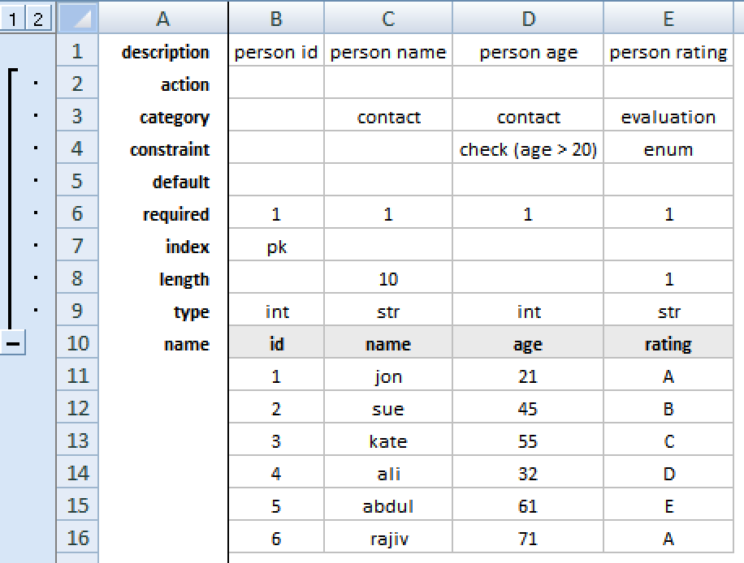

User Guide
==========

Installation
------------

The project repo can be downloaded from https://github.com/rezayat/xlschema

The current version requires python3.5+::

  $ git clone https://github.com/rezayat/xlschema.git
  $ cd xlschema
  $ source ./scripts/mkvenv.sh

Overview
--------

``xlschema`` is a python 3 tool and library for developers which facilitates the round-trip generation of code for relational database models.

Users can generate *data mapping* code in multiple formats {python, java, haskell, etc.} by providing schema definitions and related data from:

1. A conventionally structured YAML or Microsoft Excel (xlsx) file called a :term:`Specfile`.

2. Reflecting via database connections to live databases.

Benefits
^^^^^^^^

- Save development time by generating boilerplate code which is typically written by hand, and which must be re-written every time the object model changes, which is typical at the early stage of a development project.

- Provides a high-level model :py:class:`xlschema.models.Schema` which can be used to generate code in multiple output formats and languages.

- An Excel/YAML :term:`Specfile` is designed to be easy to read and populate by both technical and non-technical users, and can be used to model a complete relational database or object-oriented project structure.

Features
^^^^^^^^

- Ability to define schema alone or schema and data

- Template Engine Agnostic:
  - Jinja2
  - Mako
  - Cheetah (Yelp Fork)

- Round-trip conversion from xlsx/yaml/databases to
    - postgres sql
    - sqlite sql
    - django models
    - sqlalchemy models
    - haskell models
    - restructured text
    - yaml files
    - etc.

- Automatically add validation to xlsx :term:`Specfile`.

- Clean and extendable code generation architecture
    - Well tested (>200 tests) with 100% test coverage.
    - Decent docs (can be improved) / UML class diagrams
    - Modular, easy to extend architecture with custom classes, templates
    - Plugin system for modular extension of features

 - Currently code generation options include the following languages:

    - Documentation Formats
        - Restructured Text

    - Excel
        - XLSX Files (with auto-validation from Enums)

    - Haskell
        - postgres-simple & postgres-orm
        - persistent framework

    - Java
        - java hibernate code
        - scala hibernate code

    - Python
        - sqlalchemy models
        - django models
        - psycopg models
        - pandas code
        - records models

    - R Language
        - Rmarkdown
        - R database code

    - SAP
        - ABAP (untested)

    - SQL
        - Postgresql
            - As single file
            - As multiple files
            - With Enumerations
            - Tests (Pgtap)
        - Sqlite (generic SQL)

    - YAML
        - xlschema format data definition files

Key Concepts
------------

.. image:: _static/uml/class-flow.svg
  :align: center

.. glossary::

  Specfile
    A file of type ``*.xlsx`` or ``*.yml|*.yaml`` which contains a structure
    that is readable by ``xlschema``.

  Database
    A database accessible using sqlalchemy connection string

  SchemaReader
    A class which subclasses :py:class:`xlschema.readers.abstract.SchemaReader`,
    which consumes a ``Specfile`` or a ``Database`` to produce a ``Schema``.

  SchemaWriter
    A class which subclasses :py:class:`xlschema.writers.abstract.SchemaWriter`,
    consumes a ``Schema`` instance and uses a ``Template`` to generate ``Code``.

  Template
    A template of type Jinja2, used for generating code.

  Schema
    A class or subclass of type :py:class:`xlschema.models.Schema` which contains
    models, enumerations, types and metadata. It has a one-to-one correspondance
    to a yaml/xlsx file or database schema. The structure of this is as follows:

.. glossary::

  Model
    A class or subclass of type :py:class:`xlschema.models.Model` which contains
    fields, properties, metadata and data. Corresponds to a table in a RDBMS.

  Enum
    A class or subclass of type :py:class:`xlschema.models.Enum` which contains
    key-value data. Corresponds to an enum type in a database.

  Field
    A class or subclass of type :py:class:`xlschema.models.Field` which contains
    metafields and their corresponding values. Corresponds to a field in a RDBMS.

  Property
    A dictionary of user-facing (key, values)

  Metadata
    A dictionary of system-facing (key, values)

  Metafield
    A field of :py:class:`xlschema.models.Field`. Examples are ``name`` and ``type``.

The table below explains metafield definition requirements:

=============  ================== ========= ===================================
Metafield      Type               Required  Definition
=============  ================== ========= ===================================
Name           Any str            Yes       Name of field
Type           str|int|dec|bool   Yes       Type of field
Length         int                No        Specifies length of a str type
Index          pk|sk|fk           No        Primary, Semantic, or Foreign key
Required       1|0                No        Field is required or not
Constraint     Any                No        Column-level constraints
Category       Any                No        Category of the field
Action         Any                No        Custom column-specific actions
Description    Any                No        General description of the field
=============  ================== ========= ===================================

Quickstart
----------

Installation
^^^^^^^^^^^^

The current version requires python3.5+ ::

  $ git clone https://github.com/rezayat/xlschema.git
  $ cd xlschema
  $ source ./scripts/mkvenv.sh

Commandline
^^^^^^^^^^^

XLSchema is a built around a plugin framework. Its core function is applied by the ``from_uri`` subcommand, which converts from xlsx/yaml or a db_uri to the implemented xlschema formats::

  $ python3 -m xlschema --help
  usage: xlschema [-h] [--output OUTPUT] [--prefix PREFIX] [--clean] plugin ...

  Round-trip relational model code generation framework.

  positional arguments:
    plugin
      from_uri            Generate model code from URI.
      echo                Echo command-line options.
      display             Display available writers.
      to_sqla             Generate sqlalchemy schemas from databases.
      split_xlsx          Splits xlsx sheets from a column.

  optional arguments:
    -h, --help            show this help message and exit
    --output OUTPUT, -o OUTPUT
                          set output directory (default: None)
    --prefix PREFIX       set prefix of output (default: None)
    --clean, -c           clean output dir before generation (default: False)

When using the ``from_uri`` subcommand, the options are as follows::

  $ python3 -m xlschema from_uri --help
  usage: xlschema from_uri [-h] [--run] [--populate] [--update-only]
                           [--models-only] [--view]
                           [--table [TABLE [TABLE ...]]] [--sql [SQL [SQL ...]]]
                           [--format [FORMAT [FORMAT ...]]]
                           uri

  positional arguments:
    uri                   uri to operate on

  optional arguments:
    -h, --help            show this help message and exit
    --run, -r             autorun with all options
    --populate, -p        populate database
    --update-only, -u     only gen update code
    --models-only         only gen model code
    --view, -v            include views
    --table [TABLE [TABLE ...]], -t [TABLE [TABLE ...]]
                          table(s) to dump
    --sql [SQL [SQL ...]], -s [SQL [SQL ...]]
                          sql to use for selection
    --format [FORMAT [FORMAT ...]], -f [FORMAT [FORMAT ...]]
                          abap/oo, csv/multi, hs/model, hs/persist, hs/schema,
                          java/hibernate, py/djadmin, py/django, py/djfactories,
                          py/djfactorytests, py/djmodels, py/djrestviews,
                          py/djserializers, py/pandas, py/psycopg, py/records,
                          py/sqlalchemy, r/data, rmd/rmarkdown, rst/sphinx,
                          scala/hibernate, sql/pgenum, sql/pgschema, sql/pgtap,
                          sql/postgres, sql/sqlite, xlsx/validation, yml/yaml

Typical use cases would be as follows:

From Files (YAML/XLSX)
""""""""""""""""""""""

- dump schema and data from yaml specification file into all formats::

  $ python3 -m xlschema from_uri data/yml/node.yml

- dump schema and data from xlsx specification file into single format::

  $ python3 -m xlschema from_uri --format sql/sqlite data/xlsx/schema.xlsx

From Database
"""""""""""""

- dump all tables in db into all formats::

  $ python3 -m xlschema from_uri sqlite:///data/db/test.sqlite

- dump all tables in db into single format::

  $ python3 -m xlschema from_uri sqlite:///data/db/test.sqlite --format sql/sqlite

- dump results of sql statements into all formats::

  $ python3 -m xlschema from_uri sqlite:///data/db/test.sqlite --sql 'select * from person'

- dump tables into all formats::

  $ python3 -m xlschema from_uri sqlite:///data/db/test.sqlite --table person vehicle

Use as a Library (API)
^^^^^^^^^^^^^^^^^^^^^^

Walkthrough
"""""""""""

First import the main library

  >>> import xlschema

To instanciate the app, we need to configure it with some options

  >>> app = xlschema.XLSchema('tests/data/yml/node.yml',
  ...                          output='tests/data/output',
  ...                          clean=True,
  ...                          update_only=False)

As soon as the ``app`` is available, we have access to the schema:

  >>> app.schema
  <Schema 'node'>
  >>> app.schema.name
  'node'
  >>> app.schema.models
  [<Model 'node'>]
  >>> app.schema.enums
  {'status': <Enum 'status'>}
  >>> app.schema.metadata
  {}

This provides access to the underlying models:

  >>> model = app.schema.models[0]
  >>> model.name
  'node'
  >>> model.types
  ['int', 'int', 'str', 'str']
  >>> enum = app.schema.enums['status']
  >>> enum.name
  'status'

The ``app`` also has access to configured writers

  >>> app.writer_types
  ['abap/oo', 'csv/multi', 'hs/model', 'hs/persist', 'hs/schema', 'java/hibernate', 'pkg/djapp', 'py/djadmin', 'py/djfactories', 'py/djfactorytests', 'py/djmodels', 'py/djrestviews', 'py/djserializers', 'py/pandas', ... 'yml/yaml']
  >>> [writer.__class__.__name__ for writer in app.writers]
  ['AbapWriter', 'CsvWriter', 'HaskellModelWriter', 'HaskellPersistWriter', 'HaskellSchemaWriter', 'JavaWriter', 'DjangoAppWriter', 'DjangoAdminWriter', ... 'YamlWriter']

To generate code, we need a :py:class:`~SchemaWriter` class:

  >>> writer = app.get_writer('sql/sqlite')
  >>> writer.schema.name
  'node'

:py:class:`~SchemaWriter` instances specialize the model and fields:

  >>> model = writer.schema.models[0]
  >>> model.types
  ['integer', 'integer', 'varchar(50)', 'varchar(10)']

Extended Tutorial
-----------------

Generating from YAML
^^^^^^^^^^^^^^^^^^^^

1. Write your single model specification file in yaml, call it ``node.yml``

.. code-block:: yaml

  enums:
    - name: status
      data:
        - [created,  Created]
        - [open,     Open]
        - [finished, Finished]
        - [closed,   Closed]

  models:
    - name: node
      fields:
        - name: id
          type: int
          index: pk

        - name: parent_id
          type: int
          index: fk

        - name: name
          type: str
          length: 50
          required: true

        - name: status
          type: str
          length: 10
          required: true
          constraint: enum

      data:
        - [1, null, A, created]
        - [2, 1,    B, open]
        - [3, 1,    C, finished]
        - [4, 2,    D, created]
        - [5, 4,    E, closed]
        - [6, 4,    F, finished]

2. Run xlschema

Test as follows::

  $ python3 -m xlschema from_uri data/yml/node.yml

3. Check the results

xlschema will generate a lot of files in ``data/output``. Open one of them ``data/output/node_pgenum.sql``

.. code-block:: postgresql

  drop type status cascade;
  create type status as enum (
      'created',
      'open',
      'finished',
      'closed'
  );

  drop table if exists node cascade;
  create table node
  (
      id integer primary key,
      parent_id integer references node (id),
      name varchar(50) not null,
      status status not null
  );

  -- node DATA
  insert into node values (1, null, 'A', 'created');
  insert into node values (2, 1, 'B', 'open');
  insert into node values (3, 1, 'C', 'finished');
  insert into node values (4, 2, 'D', 'created');
  insert into node values (5, 4, 'E', 'closed');
  insert into node values (6, 4, 'F', 'finished');

Also have a look at ``data/output/node_djmodels.py``

.. code-block:: python

  from datetime import datetime
  from django.db import models

  # NODE
  # ----------------------------------------------------------
  STATUS = [
      ("created", "Created"),
      ("open", "Open"),
      ("finished", "Finished"),
      ("closed", "Closed"),
  ]

  class Node(models.Model):
      id = models.IntegerField(blank=False, null=False, primary_key=True)
      parent = models.ForeignKey("self", blank=True, null=True, related_name="children", on_delete=models.CASCADE)
      name = models.CharField(blank=False, null=False, max_length=50)
      status = models.CharField(blank=False, null=False, choices=STATUS, max_length=10)
      class Meta:
          db_table = "node"
          verbose_name_plural = "nodes"

      def __str__(self):
          return "Node-{}".format(self.id)

Generating from Excel
^^^^^^^^^^^^^^^^^^^^^

In the context of excel, an XLSchema schema corresponds to a ``.xlsx`` file, which should have at least one ``Model Sheet`` and one ``ENUMs`` sheet.

The user can populate one of several types of sheets in the xlsx file that can be used for inputing schemas into ``xlschema``. Fundamentally, there are two types (A) ``Model`` sheets where each sheet corresponds to an sql table and (B) the ``Enums`` sheet.

If this file was named ``node.xlsx``, we could call xlschema as follows::

  $ python -m xlschema -f sql/postgres person.xlsx

The output of this operation would be a postgres sql file that translates exactly the data structure and data specified in the xlsx file.

.. code-block:: postgresql

  drop table if exists person cascade;
  create table person
  (
      id integer primary key not null,
      name varchar(10) not null,
      age integer check (age > 20) not null,
      rating integer not null
  );

  insert into person values (1, 'jon', 21, 1);
  insert into person values (2, 'sue', 45, 2);
  insert into person values (3, 'kate', 55, 2);
  insert into person values (4, 'ali', 32, 1);
  insert into person values (5, 'abdul', 61, 5);
  insert into person values (6, 'rajiv', 71, 3);

Model Sheets
""""""""""""

================= ========== ======= =======
Model Sheet Type  Properties Fields  Data
================= ========== ======= =======
Data Sheets       No         Yes     Yes
NoData Sheets     No         Yes     No
Property Sheets   Yes        Yes     Yes
================= ========== ======= =======

Model sheets have one of three possible sections:

1. A **Properties** section for per sheet configuration values

2. A **Fields** section which defines the structure and type of data that is to come.

3. **Data**: the content itself which conforms to the previously defined specification.

Data Sheets
###########

- :py:class:`xlschema.readers.xlsx.sheets.DataSheet`

It is probably easier to understand this visually. In the graphic below, the range ``B1:E9`` is the area of **Fields** and the range of ``B10:E15`` below is **Data** with the gray filling of the field name row visually separating the two areas.

It is important to understand that sheets can refer to each other. For example each row in the vehicle sheet refers to a corresponding row in the person sheet. Such *foreign key relationships* are specified using the ``fk`` option in the ``index`` row and a reference to the corresponding id of the target row.

No-Data Sheets
##############

- :py:class:`xlschema.readers.xlsx.sheets.NoDataSheet`

Property Sheets
###############

- :py:class:`xlschema.readers.xlsx.sheets.PropertySheet`

Enumeration Sheet
"""""""""""""""""

There is another special sheet called ``ENUMs`` which is used to specify enumerations. Only the first two columns in this sheet are used.

The enums sheet allows us to generate validations for round-trip data entry and also enables some straightforward generation of boiler-plate code for multiple languages.

FAQ
---

Release Notes
-------------
